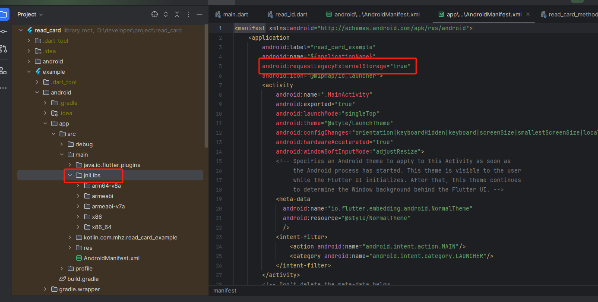

# read_card

## 身份证nfc读取插件

#### 首先调用

```dart
import 'package:read_card/read_card.dart';

///初始化方法,参数可以点进去看一下
bool initStatus = await
_readCardPlugin.initEid
(
appId: '1190807',
ip: "testeidcloudread.eidlink.com",
port: 9989,
envCode: 26814);
```

### 读取身份证信息

[example](example/lib/read_id.dart)

#### 记得把android项目下添加jniLibs和添加requestLegacyExternalStorage
